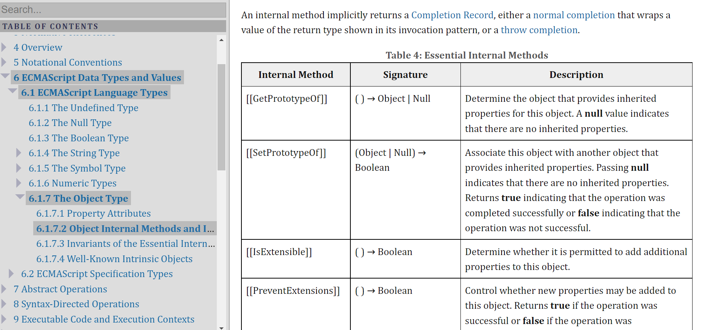

# 16장: 프로퍼티 어트리뷰트

### 몰랐던 것들:

- 프로퍼티 어트리뷰트
- getter/setter 함수


> #### 프로퍼티(10장)
>
> 객체(object)는 프로퍼티의 집합이며, 프로퍼티는 키와 값으로 구성된다.


## 16.1 내부 슬롯과 내부 메서드

내부 슬롯과 내부 메서드는 자바스크립트 엔진의 구현 알고리즘을 설명하기 위해 ECMAScript 사양에서 사용하는 의사 프로퍼티(pseudo property)와 의사 메서드(pseudo method)다. ECMAScript 사양에 등장하는 이중 대괄호로 감싼 이름들이 내부 슬롯과 내부 메서드다.



[출처](https://tc39.es/ecma262/#sec-object-internal-methods-and-internal-slots)

> Internal slots correspond to internal state that is associated with objects and used by various ECMAScript specification algorithms. Internal slots are not object properties and they are not inherited. Depending upon the specific internal slot specification, such state may consist of values of any [ECMAScript language type](https://tc39.es/ecma262/#sec-ecmascript-language-types) or of specific ECMAScript specification type values. Unless explicitly specified otherwise, internal slots are allocated as part of the process of creating an object and may not be dynamically added to an object. Unless specified otherwise, the initial value of an internal slot is the value undefined. Various algorithms within this specification create objects that have internal slots. However, the ECMAScript language provides no direct way to associate internal slots with an object.


내부 슬롯과 내부 메서드는 ECMAScript 사양에 정의된 대로 자바스크립트 엔진에서 실제로 동작하지만 개발자가 직접 접근할 수 있도록 공개된 객체의 프로퍼티는 아니다. 즉, 내부 슬롯과 내부 메서드는 자바스크립트 엔진의 내부 로직이므로 원칙적으로 직접 접근하거나 호출할 수 있는 방법을 제공하지 않는다.

하지만 일부 내부 슬롯과 내부 메서드에 한하여 간접적으로 접근할 수 있는 수단을 제공하기는 한다. 예를 들어 `[[Prototype]]` 내부 슬롯의 경우, `__proto__`를 통해 간접적으로 접근할 수 있다.

```js
const o = {};

// 내부 슬롯은 자바스크립트 엔진의 내부 로직이므로 직접 접근할 수 없다.
o.[[Prototype]] // -> Uncaught SyntaxError: Unexpected token '['
// 단, 일부 내부 슬롯과 내부 메서드에 한하여 간접적으로 접근할 수 있는 수단을 제공하기는 한다.
o.__proto__ // -> Object.prototype
```


## 16.2 프로퍼티 어트리뷰트와 프로퍼티 디스크립터 객체

**자바스크립트 엔진은 프로퍼티를 생성할 때 프로퍼티의 상태를 나타내는 프로퍼티 어트리뷰트를 기본값으로 자동 정의**한다.

프로퍼티의 상태란

- 프로퍼티의 값 (value)
- 값의 갱신 가능 여부 (writeable)
- 열거 가능 여부 (enumerable)
- 재정의 가능 여부 (configurable)

를 말하는데, 각각은 내부 슬롯 `[[Value]]`, `[[Writable]]`, `[[Enumerable]]`, `[[Configurable]]` 이다. 따라서 직접 접근할 수는 없지만 이를 `Object.getOwnPropertyDescriptor` 메서드를 사용하여 간접적으로 확인할 수는 있다.

```js
const person = {
	name: 'Lee'
};

// 프로퍼티 어트리뷰트 정보를 제공하는 프로퍼티 디스크립터 객체를 반환한다.
console.log(Object.getOwnPropertyDescriptor(person, 'name'));
// {value: 'Lee', writable: true, enumerable: true, configurable: true}
```

`Object.getOwnPropertyDescriptor` 메서드를 호출할 때, 첫 번째 매개변수에는 객체의 참조를 전달하고, 두 번째 매개변수에는 프로퍼티 키를 문자열로 전달한다. 그러면 이 메서드는 프로퍼티 어트리뷰트 정보를 제공하는 **프로퍼티 디스크립터 객체**를 반환한다. 만약 존재하지 않는 프로퍼티나 상속받은 프로퍼티에 대한 프로퍼티 디스크립터를 요구하면 `undefined`가 반환된다. 해당 메서드는 하나의 프로퍼티에 대해 객체를 반환하지만 `Object.getOwnPropertyDescriptors` 메서드는 모든 프로퍼티의 프로퍼티 어트리뷰트 정보를 제공하는 프로퍼티 디스크립터 **객체들**를 반환한다.

```js
const person = {
	name: 'Lee'
};

// 프로퍼티 동적 생성
person.age = 23;

// 프로퍼티 어트리뷰트 정보를 제공하는 프로퍼티 디스크립터 객체를 반환한다.
console.log(Object.getOwnPropertyDescriptors(person));
/*
{
	age: {value: 23, writable: true, enumerable: true, configurable: true}
	name: {value: 'Lee', writable: true, enumerable: true, configurable: true}
}
*/
```


## 16.3 데이터 프로퍼티와 접근자 프로퍼티

프로퍼티는 데이터 프로퍼티와 접근자 프로퍼티로 구분할 수 있다.

**데이터 프로퍼티**(data property)

키와 값으로 구성된 일반적인 프로퍼티다. 지금까지 살펴본 모든 프로퍼티는 데이터 프로퍼티다.

**접근자 프로퍼티**(accessor property)

자체적으로는 값을 갖지 않고 다른 데이터 프로퍼티의 값을 읽거나 저장할 때 호출되는 접근자 함수(accessor function)로 구성된 프로퍼티다.


#### 1. 데이터 프로퍼티

데이터 프로퍼티(data property)는 다음과 같은 프로퍼티 어트리뷰트를 갖는다. 이 프로퍼티 어트리뷰트는 자바스크립트 엔진이 프로퍼티를 생성할 때 기본값으로 자동 정의된다.

| 프로퍼티 어트리뷰트 | 프로퍼티 디스크립터 객체의 프로퍼티 | 설명 |
| ------------------- | ----------------------------------- | ------------------------------------------------------------ |
| `[[Value]]`         | `value`                             | 프로퍼티 키를 통해 프로퍼티 값에 접근하면 반환되는 값이다.프로퍼티 키를 통해 프로퍼티 값을 변경하면 `[[Value]]`에 값을 재할당한다. 이때 프로퍼티가 없으면 프로퍼티를 동적 생성하고 생성된 프로퍼티의 `[[Value]]`에 값을 저장한다. |
| `[[Writable]]`      | `writable`                          | 프로퍼티 값의 변경 가능 여부를 나타내며 불리언 값을 갖는다.`[[Writable]]`의 값이 `false`인 경우 해당 프로퍼티의 `[[Value]]` 값을 변경할 수 없는 읽기 전용 프로퍼티가 된다. |
| `[[Enumerable]]`    | `enumerable`                        | 프로퍼티의 열거 가능 여부를 나타내며 불리언 값을 갖는다.`[[Enumerable]]`의 값이 `false`인 경우 해당 프로퍼티는 `for...in`문이나 `Object.keys` 메서드 등으로 열거할 수 없다. |
| `[[Configurable]]`  | `configurable`                      | 프로퍼티의 재정의 가능 여부를 나타내며 불리언 값을 갖는다.`[[Configurable]]` 값이 `false`인 경우 해당 프로퍼티의 삭제, 프로퍼티 어트리뷰트 값의 변경이 금지된다. 단, `[[Writable]]`이 `true`인 경우 `[[Value]]` 변경과 `[[Writable]]`을 `false`로 변경하는 것이 허용된다. |

```js
const person = {
  name: 'Lee'
};

// 프로퍼티 어트리뷰트 정보를 제공하는 프로퍼티 디스크립터 객체를 취득한다.
console.log(Object.getOwnPropertyDescriptor(person, 'name'));
// {value: "Lee", writable: true, enumerable: true, configurable: true}
```

이처럼 프로퍼티가 생성될 때 `[[Value]]`의 값은 프로퍼티 값으로 초기화되며 `[[Writable]]`, `[[Enumerable]]`, `[[Configurable]]`의 값은 모두 `true`로 초기화된다. 이것은 프로퍼티를 동적 추가해도 마찬가지다.

```js
const person = {
  name: 'Lee'
};
// 프로퍼티 동적 생성
person.age = 20;

console.log(Object.getOwnPropertyDescriptors(person));
/*
{
    age: {value: 20, writable: true, enumerable: true, configurable: true}
    name: {value: 'Lee', writable: true, enumerable: true, configurable: true}
}
*/
```


#### 2. 접근자 프로퍼티

| 프로퍼티 어트리뷰트 | 프로퍼티 디스크립터 객체의 프로퍼티 | 설명                                                         |
| ------------------- | ----------------------------------- | ------------------------------------------------------------ |
| `[[Get]]`           | `get`                               | 접근자 프로퍼티를 통해 데이터 프로퍼티의 값을 읽을 때 호출되는 접근자 함수다. 접근자 프로퍼티 키로 프로퍼티 값에 접근하면 프로퍼티 어트리뷰트 `[[Get]]`의 값, 즉 getter 함수가 호출되고 그 결과가 프로퍼티 값으로 반환된다. |
| `[[Set]]`           | `set`                               | 접근자 프로퍼티를 통해 데이터 프로퍼티의 값을 저장할 때 호출되는 접근자 함수다. 접근자 프로퍼티 키로 프로퍼티 값을 저장하면 프로퍼티 어트리뷰트 `[[Set]]`의 값, 즉 setter 함수가 호출되고 그 결과가 프로퍼티 값으로 저장된다. |
| `[[Enumerable]]`    | `enumerable`                        | 데이터 프로퍼티의 `[[Enumerable]]`과 같다.                   |
| `[[Configurable]]`  | `configurable`                      | 데이터 프로퍼티의 `[[Configurable]]`과 같다.                 |


접근자 함수는 `getter/setter` 함수라고도 부른다. 접근자 프로퍼티는 `getter/setter`함수를 모두 정의할 수도, 하나만 정의할 수도 있다.

```js
const person = {
  // 데이터 프로퍼티
  firstName: 'Ungmo',
  lastName: 'Lee',
  
  // fullName은 접근자 함수로 구성된 접근자 프로퍼티다.
  // getter 함수
  get fullName() {
    return `${this.firstName} ${this.lastName}`;
  },
  // setter 함수
  set fullName(name) {
  	[this.firstName, this.lastName] = name.split(' ');
  }
};

// 데이터 프로퍼티를 통한 프로퍼티 값의 참조
console.log(person.firstName + ' ' + person.lastName); // Ungmo Lee

// 접근자 프로퍼티를 통한 프로퍼티 값의 저장
// 접근자 프로퍼티 fullName에 값을 저장하면 setter 함수가 호출된다.
person.fullName = 'Heegun Lee';
console.log(person); // {firstName: "Heegun", lastName: "Lee"}

// 접근자 프로퍼티를 통한 프로퍼티 값의 참조
// 접근자 프로퍼티 fullName에 접근하면 getter 함수가 호출된다.
console.log(person.fullName); // Heegun Lee

// firstName은 데이터 프로퍼티. 프로퍼티 어트리뷰트를 가진다.
let descriptor = Object.getOwnPropertyDescriptor(person, 'firstName');
console.log(descriptor);
// {value: "Heegun", writable: true, enumerable: true, configurable: true}

// fullName은 접근자 프로퍼티. 프로퍼티 어트리뷰트를 가진다.
descriptor = Object.getOwnPropertyDescriptor(person, 'fullName');
console.log(descriptor);
// {get: f, set: f, enumerable: true, configurable: true}
```

메서드 앞에 `get`, `set`이 붙은 메서드가 있는데, 이것들이 바로 getter와 setter 함수이고, getter/setter 함수의 이름 `fullName`이 접근자 프로퍼티다. 접근자 프로퍼티는 자체적으로 값(프로퍼티 어트리뷰트 `[[value]]`)을 가지지 않으며 다만 데이터 프로퍼티의 값을 읽거나 저장할 때 관여할 뿐이다.

이를 내부 슬롯/메서드 관점에서 설명하면 다음과 같다.

접근자 프로퍼티 `fullName`으로 프로퍼티 값에 접근하면 내부적으로 `[[Get]]` 내부 메서드가 호출되어 다음과 같이 동작한다.

1. 프로퍼티 키가 유효한지 확인한다. 프로퍼티 키는 문자열 또는 심벌이어야 한다. 프로퍼티 키 "fullName"은 문자열이므로 유효한 프로퍼티 키다.
2. 프로토타입 체인에서 프로퍼티를 검색한다. `person` 객체에 `fullName` 프로퍼티가 존재한다.
3. 검색된 `fullName` 프로퍼티가 데이터 프로퍼티인지 접근자 프로퍼티인지 확인한다. `fullName` 프로퍼티는 접근자 프로퍼티다.
4. 접근자 프로퍼티 `fullName`의 프로퍼티 어트리뷰트 `[[Get]]`의 값, 즉 `getter` 함수를 호출하여 그 결과를 반환한다. 프로퍼티 `fullName`의 프로퍼티 어트리뷰트 `[[Get]]`의 값은 `Object.getOwnPropertyDescriptor` 메서드가 반환하는 프로퍼티 디스크립터 객체의 `get` 프로퍼티 값과 같다.

> **프로토타입**
>
> 프로토타입은 어떤 객체의 상위(부모) 객체의 역할을 하는 객체다. 프로토타입은 하위(자식) 객체에게 자신의 프로퍼티와 메서드를 상속한다. 프로토 타입 객체의 프로퍼티나 메서드를 상속받은 하위 객체는 자신의 프로퍼티 또는 메서드인 것처럼 자유롭게 사용할 수 있다.
>
> 프로토타입 체인은 프로토타입이 단방향 링크드 리스트 형태로 연결되어 있는 상속 구조를 말한다. 객체의 프로퍼티나 메서드에 접근하려고 할 때 해당 객체에 접근하려는 프로퍼티 또는 메서드가 없다면 프로토타입 체인을 따라 프로토타입의 프로퍼티나 메서드를 차례대로 검색한다. 19장에서 더 자세히 알아본다.


접근자 프로퍼티와 데이터 프로퍼티를 구별하는 방법은 다음과 같다.

```js
// 일반 객체의 __proto__는 접근자 프로퍼티다.
Object.getOwnPropertyDescriptor(Object.prototype, '__proto__');
// {get: f, set: f, enumerable: false, configurable: true}

// 함수 객체의 prototype은 데이터 프로퍼티다.
Object.getOwnPropertyDescriptor(function() {}, 'prototype');
// {value: {...}, writable: true, enumerable: false, configurable: false}
```

`Object.getOwnPropertyDescriptor` 메서드가 프로퍼티 어트리뷰트를 객체로 표현한 프로퍼티 디스크립터 객체를 보면 알 수 있다.


## 16.4 프로퍼티 정의

프로퍼티 정의란 새로운 프로퍼티를 추가하면서 프로퍼티 어트리뷰트를 명시적으로 정의하거나, 기존 프로퍼티의 프로퍼티 어트리뷰트를 재정의하는 것을 말한다. 예를 들어 , 프로퍼티 값을 갱신 가능하도록 할 것인지, 프로퍼티를 열거 가능하도록 할 것인지, 프로퍼티를 재정의 가능하도록 할 것인지 정의할 수 있다.

`Object.defineProperty` 메서드를 사용하면 프로퍼티의 어트리뷰트를 정의할 수 있다. 인수로는 객체의 참조와 데이터 프로퍼티의 키인 문자열, 프로퍼티 디스크립터 객체를 전달한다.

```js
const person = {};

// 데이터 프로퍼티 정의
Object.defineProperty(person, 'firstName', {
  value: "Ungmo",
  writable: true,
  enumerable: true,
  configurable: true
});
Object.defineProperty(person, 'lastName', {
  value: "Lee"
});

let descriptor = Object.getOwnPropertyDescriptor(person, 'firstName');
console.log('firstName', descriptor);
// firstName {value: "Ungmo", writable: true, enumerable: true, configurable: true}

// 디스크립터 객체의 프로퍼티를 누락시키면 undefined, false가 기본값이다.
descriptor = Object.getOwnPropertyDescriptor(person, 'lastName');
console.log('lastName', descriptor);
// lastName {value: "Lee", writable: false, enumerable: false, configurable: false}

// [[Enumerable]]의 값이 false의 경우 for..in 이나 Object.keys 등으로 열거할 수 없다.
console.log(Object.keys(person)); // ["firstName"]

// [[Writable]]의 값이 false의 경우 해당 프로퍼티의 [[Value]]의 값을 변경할 수 없다.
// 이때 값을 변경하면 에러는 발생하지 않고 무시된다.
person.lastName = "Kim"; 

// [[Configurable]]의 값이 false의 경우 해당 프로퍼티를 삭제할 수 없다.
// 이때 프로퍼티를 삭제하면 에러는 발생하지 않고 무시된다.
delete person.lastName;

// [[Configurable]]의 값이 false의 경우 해당 프로퍼티를 재정의할 수 없다.
Object.defineProperty(person, 'lastName', { enumerable: true });
// Uncaught TypeError: Cannot redefine property: lastName

descriptor = Object.getOwnPropertyDescriptor(person, 'lastName');
console.log('lastName', descriptor);
// lastName {value: "Lee", writable: false, enumerable: false, configurable: false}

// 접근자 프로퍼티 정의
Object.defineProperty(person, 'fullName', {
  // getter 함수
  get() {
    return `${this.firstName} ${this.lastName}`;
  },
  // setter 함수
  set() {
  	[this.firstName, this.lastName] = name.split(' ');
  },
  enumerable: true,
  configurable: true
});

descriptor = Object.getOwnPropertyDescriptor(person, 'fullName');
console.log('fullName', descriptor);
// fullName {get: f, set: f, enumerable: true, configurable: true}

person.fullName = "Heegun Lee";
console.log(person); // {firstName: "Heegun", lastName: "Lee"}
```

`Object.defineProperty` 메서드로 프로퍼티를 정의할 때, 디스크립터 객체의 프로퍼티를 일부 생략할 수 있다.

생략했을 때 어트리뷰트의 기본값은 다음 표와 같다.

| 프로퍼티 디스크립터 객체의 프로퍼티 | 대응하는 프로퍼티 어트리뷰트 | 생략했을 때의 기본값 |
| ----------------------------------- | ---------------------------- | -------------------- |
| `value`                             | `[[Value]]`                  | `undefined`          |
| `get`                               | `[[Get]]`                    | `undefined`          |
| `set`                               | `[[Set]]`                    | `undefined`          |
| `writable`                          | `[[Writable]]`               | `false`              |
| `enumerable`                        | `[[Enumerable]]`             | `false`              |
| `configurable`                      | `[[Configurable]]`           | `false`              |


`Object.defineProperties` 메서드를 사용하면 여러 개의 프로퍼티를 한 번에 정의할 수 있다.

```js
const person = {};

Object.defineProperties(person, {
  // 데이터 프로퍼티 정의
  firstName: {
    value: 'Ungmo',
    writable: true,
    enumerable: true,
    configurable: true
  },
  lastName: {
    value: 'Lee',
    writable: true,
    enumerable: true,
    configurable: true
  },
  // 접근자 프로퍼티 정의
  fullName: {
    // getter 함수
    get() {
      return `${this.fullName} ${this.lastName}`;
    },
    // setter 함수
    set(name) {
      [this.firstName, this.lastName] = name.split(' ');
    },
    enumerable: true,
    configurable: true
  }
});

person.fullName = 'Heegun Lee';
console.log(person); // {firstName: "Heegun", lastName: "Lee"}
```


## 16.5 객체 변경 방지

자바스크립트는 객체의 변경을 방지하는 다양한 메서드를 제공한다.

각 메서드들은 다음과 같이 변경을 금지하는 강도가 다르다.

| 구분           | 메서드                     | 프로퍼티 추가 | 프로퍼티 삭제 | 프로퍼티 값 읽기 | 프로퍼티 값 쓰기 | 프로퍼티 어트리뷰트 재정의 |
| -------------- | -------------------------- | ------------- | ------------- | ---------------- | ---------------- | -------------------------- |
| 객체 확장 금지 | `Object.preventExtensions` | X             | O             | O                | O                | O                          |
| 객체 밀봉      | `Object.seal`              | X             | X             | O                | O                | X                          |
| 객체 동결      | `Object.freeze`            | X             | X             | O                | X                | X                          |


#### 1. 객체 확장 금지

`Object.preventExtensions` 메서드는 객체의 확장을 금지한다. 즉, **프로퍼티 추가가 금지된다.**

프로퍼티는 프로퍼티 동적 추가와 `Object.defineProperty` 메서드로 추가할 수 있는데, 이 두 가지 방법이 모두 금지된다. 확장이 가능한 객체인지 여부는 `Object.isExtensible` 메서드로 확인할 수 있다.

```js
const person = { name: 'Ungmo' };

// person 객체는 확장이 금지된 객체가 아니다.
console.log(Object.isExtensible(person)); // true

// person 객체의 확장을 금지하여 프로퍼티 추가를 금지한다.
Object.preventExtensions(person);

// person 객체는 확장이 금지된 객체다.
console.log(Object.isExtensible(person)); // false

// 프로퍼티 추가가 금지된다.
person.age = 20; // 무시. strict mode에서는 에러
console.log(person); // {name: "Ungmo"}

// 프로퍼티 추가는 금지되지만 삭제는 가능하다.
delete person.name;
console.log(person); // {}

// 프로퍼티 정의에 의한 추가도 금지된다.
Object.defineProperty(person, 'age', { value: 20 });
// TypeError: Cannot define property age, object is not extensible
```


#### 2. 객체 밀봉

`Object.seal` 메서드는 객체를 밀봉한다. 객체 밀봉이란 프로퍼티 추가와 삭제, 프로퍼티 어트리뷰트 재정의 금지를 의미한다. 즉, **밀봉된 객체는 읽기와 쓰기만 가능하다.**

밀봉된 객체인지 여부는 `Object.isSealed` 메서드로 확인할 수 있다.

```js
const person = { name: 'Ungmo' };

// person 객체는 밀봉된 객체가 아니다.
console.log(Object.isSealed(person)); // false

// person 객체를 밀봉하여 프로퍼티 추가, 삭제, 재정의를 금지한다.
Object.seal(person);

// person 객체는 밀봉된 객체다.
console.log(Object.isSealed(person)); // true

// 밀봉된 객체는 configurable이 false다.
console.log(Object.getOwnPropertyDescriptors(person));
/*
{
	name: {value: "Ungmo", writable: true, enumerable: true, configurable: false},
}
*/

// 프로퍼티 추가가 금지된다.
person.age = 20; // 무시. strict mode에서는 에러
console.log(person); // {name: "Ungmo"}

// 프로퍼티 삭제가 금지된다.
delete person.name; // 무시. strict mode에서는 에러
console.log(person); // {name: "Ungmo"}

// 프로퍼티 값 갱신은 가능하다.
person.name = "Heegun";
console.log(person); // {name: "Heegun"}

// 프로퍼티 어트리뷰트 재정의가 금지된다.
Object.defineProperty(person, 'name', { configurable: true });
// TypeError: Cannot redefine property: name
```


#### 3. 객체 동결

`Object.freeze` 메서드는 객체를 동결한다. 객체 동결(freeze)이란 프로퍼티 추가와 삭제, 프로퍼티 어트리뷰트 재정의 금지, 프로퍼티 값 갱신 금지를 의미한다. 즉, **동결된 객체는 읽기만 가능하다.**

동결된 객체인지 여부는 `Object.isFrozen` 메서드로 확인할 수 있다.

```js
const person = { name: 'Ungmo' };

// person 객체는 동결된 객체가 아니다.
console.log(Object.isFrozen(person)); // false

// person 객체를 동결하여 프로퍼티 추가, 삭제, 재정의, 쓰기를 금지한다.
Object.freeze(person);

// person 객체는 동결된 객체다.
console.log(Object.isFrozen(person)); // true

// 동결된 객체는 writable과 configurable이 false다.
console.log(Object.getOwnPropertyDescriptors(person));
/*
{
	name: {value: "Ungmo", writable: false, enumerable: true, configurable: false},
}
*/

// 프로퍼티 추가가 금지된다.
person.age = 20; // 무시. strict mode에서는 에러
console.log(person); // {name: "Ungmo"}

// 프로퍼티 삭제가 금지된다.
delete person.name; // 무시. strict mode에서는 에러
console.log(person); // {name: "Ungmo"}

// 프로퍼티 값 갱신이 금지된다.
person.name = "Heegun"; // 무시. strict mode에서는 에러
console.log(person); // {name: "Ungmo"}

// 프로퍼티 어트리뷰트 재정의가 금지된다.
Object.defineProperty(person, 'name', { configurable: true });
// TypeError: Cannot redefine property: name
```


#### 4. 불변 객체

지금까지 살펴본 변경 방지 메서드들은 얕은 변경 방지로 직속 프로퍼티만 변경이 방지되고 중첩 객체까지는 영향을 주지는 못한다.

따라서 `Object.freeze`메서드로 객체를 동결하여도 중첩 객체까지 동결할 수는 없다.

```js
const person = {
  name: 'Ungmo',
  address: { city: 'Sejong' }
};

// 얕은 객체 동결
Object.freeze(person);

// 직속 프로퍼티만 동결한다.
console.log(Object.isFrozen(person)); // true
// 중첩 객체까지 동결하지 못한다.
console.log(Object.isFrozen(person.address)); // false

person.address.city = 'Suwon';
console.log(person); // {name: "Ungmo", address: {city: "Suwon"}}
```


따라서 중첩객체까지 동결하기 위해서는 객체를 값으로 갖는 모든 프로퍼티에 대해 재귀적으로 `Object.freeze` 메서드를 호출해야 한다.

```js
function deepFreeze(target) {
  if(target && typeof target === 'object' && !Object.isFrozen(target)) {
    Object.freeze(target);
  	Object.keys(target).forEach(key => deepFreeze(target[key]));
  }
  return target;
}
```


